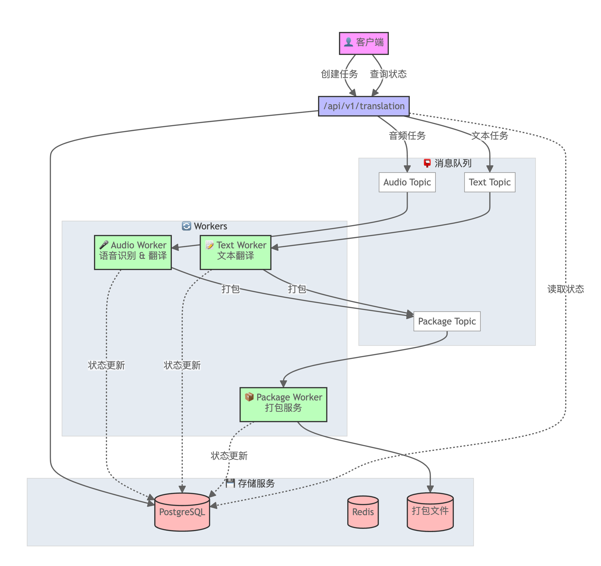

# Audio Text Translation Service

## 1. 服务设计与开发

### 1.1 翻译任务接口
项目实现了完整的 RESTful API，支持以下功能：

```python
# src/app/api/v1/translation.py
@router.post("/tasks")  # 创建翻译任务
@router.get("/tasks/{task_id}")  # 查询任务状态
@router.delete("/tasks/{task_id}")  # 取消任务
@router.get("/tasks/{task_id}/translations/{language}")  # 获取特定语言的翻译结果
```

### 1.2 语音识别与准确性校验
- 使用 Whisper 进行语音识别：
```python
# src/app/core/worker/audio_worker.py
async def process_audio_task(queued_task):
    text = await aspeech2text(source_file)
    score_task = validate_stt(text, queued_task.reference_text)
    translation_task = translate(text, queued_task.target_languages)
```

- 通过 `stt_score.py` 实现准确性校验，对比原始文本和 STT 生成内容

### 1.3 多语言翻译
- 支持多语种翻译，包括：
  - 英语 (en)
  - 简体中文 (zh-CN)
  - 繁体中文 (zh-TW)
  - 日语 (ja)
- 使用 `multilingual_translation.py` 处理翻译任务

### 1.4 文本打包系统
项目实现了高效的文本打包机制：

```python
# src/app/core/worker/packaging_worker.py
async def process_package_task(task):
    package_data = TaskData(task.task_id)
    
    # 添加文本翻译
    for translation in task.translations:
        package_data.add_translation(TextSource.TEXT, lang, text)
    
    # 添加音频翻译
    if task.stt_result:
        for lang in task.target_languages:
            package_data.add_translation(TextSource.AUDIO, LanguageCode(lang), task.stt_result)
```

### 1.5 错误处理与日志记录
- 使用 loguru 进行日志管理
- 实现了完整的错误处理机制：
  - 数据库事务回滚
  - 任务状态追踪
  - 异常捕获和记录

## 2. 可靠性 & 可扩展性

### 2.1 分布式系统设计
- 使用 Kafka 进行消息队列
- 支持多个 worker 节点并行处理
- 服务解耦：
  - audio_worker: 处理音频转文字
  - translation_worker: 处理文本翻译
  - packaging_worker: 处理文件打包

### 2.2 内存资源管理
```python
# src/app/core/worker/packaging_worker.py
def get_dynamic_batch_size():
    memory = psutil.virtual_memory()
    
    if memory.percent >= 90:
        return max(10, BASE_BATCH_SIZE // 4)
    elif memory.percent >= 80:
        return BASE_BATCH_SIZE // 2
```

- 动态调整批处理大小
- 内存使用监控
- 防止 OOM 错误

### 2.3 故障转移与任务重试
- 使用 tenacity 库实现重试机制：
```python
@retry(stop=stop_after_attempt(3), wait=wait_none())
async def process_single_message(consumer, translation_service, msg)
```

- 任务状态追踪确保不丢失
- 数据库事务保证一致性

## 3. 部署架构

### 3.1 系统架构图



系统主要包含以下组件：
- 客户端：通过 API 接口创建翻译任务和查询任务状态
- API 服务：处理 `/api/v1/translation` 相关的请求
- 消息队列：包含 Audio Topic、Text Topic 和 Package Topic
- Workers：
  - Audio Worker：处理语音识别和翻译
  - Text Worker：处理文本翻译
  - Package Worker：处理打包服务
- 存储层：
  - PostgreSQL：存储任务和状态信息
  - Redis：缓存服务
  - 打包文件存储：存储最终的翻译包

### 3.2 服务编排

使用 Docker Compose 进行服务编排：

```yaml
services:
  web:          # API 服务
  worker:       # 任务处理
  db:           # PostgreSQL 数据库
  redis:        # 缓存服务
  kafka:        # 消息队列
```

- 容器化部署
- 服务自动发现
- 易于扩展和维护

这个系统通过分布式架构、消息队列、和微服务设计，实现了高可用、可扩展的音频文本翻译服务。每个组件都可以独立扩展，通过 Docker 和消息队列实现了系统的弹性和可靠性。
